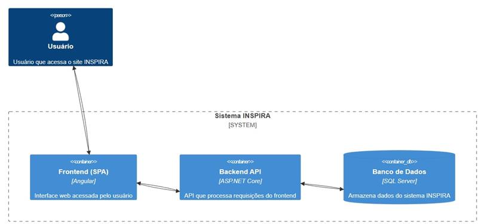
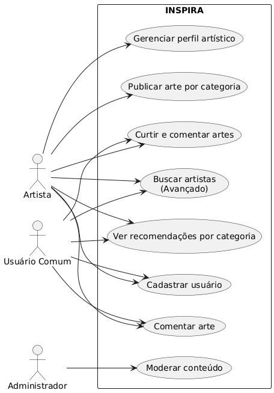

# PortifolioProjeto-2025

# Capa

- **Título do Projeto**: Inspira - Rede para Artistas Independentes.
- **Nome do Estudante**: Matheus Gabriel da Silva.
- **Curso**: Engenharia de Software.
- **Data de Entrega**: [Data].

# Resumo

O presente documento descreve o desenvolvimento de um sistema voltado para artistas independentes, permitindo a publicação de artes organizadas por tipo, facilitando a visibilidade e interação com o público. O sistema busca oferecer uma plataforma intuitiva para que artistas possam divulgar seus trabalhos e obter reconhecimento. O documento detalha a justificativa do projeto, requisitos, arquitetura, escolha da stack tecnológica, considerações de segurança e os próximos passos para sua implementação.

## 1. Introdução

- **Contexto**: A trajetória de um artista independente é repleta de desafios, especialmente quando se trata de conquistar visibilidade e construir uma base sólida de admiradores. Muitas plataformas disponíveis hoje não foram pensadas para atender às necessidades específicas desse público, oferecendo pouco espaço para personalização, organização ou alcance. Com isso, talentos promissores acabam limitados a redes genéricas e superlotadas, onde é difícil se destacar.
- **Justificativa**: Este projeto tem como objetivo preencher essa lacuna, criando uma plataforma digital dedicada à valorização da arte independente. A proposta é oferecer um espaço onde artistas possam divulgar suas obras de forma organizada e acessível, com categorização eficiente e mecanismos que estimulem a interação com o público. Ao centralizar essas funcionalidades em um único ambiente, o sistema pretende ampliar o alcance das criações artísticas, fortalecer a comunidade criativa e facilitar conexões significativas entre artistas e apreciadores.
- **Objetivos**:
  - Criar um sistema web que permita a publicação, categorização e gerenciamento de obras de arte por artistas independentes.
  - Permitir que usuários (artistas e apreciadores) interajam com as publicações por meio de curtidas, comentários e recomendações.
  - Desenvolver uma interface responsiva, intuitiva e agradável para diferentes dispositivos e perfis de usuários.
  - Implementar um sistema seguro, confiável e escalável para o armazenamento e acesso aos dados das obras e interações.

## 2. Descrição do Projeto

- **Tema do Projeto**: Desenvolvimento de um sistema para artistas independentes, permitindo a publicação de suas artes organizadas por categorias e interação com o público.
- **Problemas a Resolver**:
  - Dificuldade de artistas independentes em obter visibilidade.
  - Falta de plataformas dedicadas à exposição de arte com boa categorização.
  - Ausência de um sistema de interação entre apreciadores e artistas.
- **Limitações**:
  - O sistema não realizará venda direta de artes.
  - Não haverá integração inicial com redes sociais externas.

## 3. Especificação Técnica

### 3.1. Requisitos de Software

- **Requisitos Funcionais (RF):**
  - RF01: Cadastro de usuários (artistas e apreciadores).
  - RF02: Publicação de artes por categoria.
  - RF03: Interação entre usuários (curtidas e comentários).
  - RF04: Criação de perfis personalizados para artistas.
  - RF05: Sistema de recomendação de artes baseado em categorias.
  - RF06: Moderação de conteúdo para evitar publicações inadequadas.
  - RF07: Busca avançada por artistas.
  
- **Requisitos Não Funcionais (RNF):**
  - RNF01: Interface responsiva.
  - RNF02: Autenticação via JWT.
  - RNF03: Armazenamento otimizado de imagens.
  - RNF04: Sistema escalável para suportar crescimento da base de usuários.
  - RNF05: Tempo de resposta ágil para as requisições.

### 3.2. Considerações de Design

- Discussão sobre as escolhas de design, incluindo alternativas consideradas e justificativas para as decisões tomadas.
- **Visão Inicial da Arquitetura**: O sistema será dividido entre frontend, backend e banco de dados.
- **Padrões de Arquitetura**: Arquitetura baseada em serviços (MVC) para melhor organização do código.
- **Modelo C4**:
  

- **Use Cases**:
  

  
### 3.3. Stack Tecnológica

- **Linguagens de Programação**: C# no backend e Angular no frontend.
- **Frameworks e Bibliotecas**:
  - Backend: .NET 8.
  - Frontend: Angular.
  - Autenticação: JWT com bcrypt.
  - Logging: NLog e Serilog.
- **Ferramentas de Desenvolvimento e Gestão de Projeto**:
  - Banco de Dados: SQL Server.
  - Versionamento: Git/GitHub.
  - Gerenciamento: Trello ou Jira.

### 3.4. Considerações de Segurança

- Proteção contra SQL Injection e XSS.
- Hash de senhas com BCrypt.
- Uso de HTTPS.
- Controle de permissões e acessos para evitar fraudes.

## 4. Próximos Passos  

- **Documentação do Projeto**: Elaborar diagramas UML (casos de uso, modelo de dados e arquitetura) e detalhar requisitos.  
- **Definição de Layout e UX**: Criar wireframes e protótipos da interface para garantir uma experiência intuitiva.  
- **Criação do Modelo de Dados**: Estruturar o banco de dados conforme os requisitos levantados.  
- **Implementação das Funcionalidades CRUD**: Desenvolver as operações básicas para gerenciamento dos dados.  
- **Testes e Otimização**: Realizar testes unitários e ajustes para melhorar performance e segurança.

## 5. Referências

- Documentação oficial do Angular.
- Documentação do .NET 8.
- Princípios de segurança para aplicações web.

## 6. Apêndices (Opcionais)

-

## 7. Avaliações de Professores

